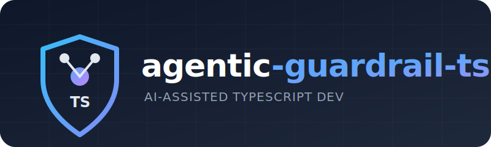

<p align="center">
  
</p>

<p align="center">
  <a href="https://github.com/Avinava/agentic-guardrail-ts/actions"></a>
  <a href="https://github.com/Avinava/agentic-guardrail-ts/blob/main/LICENSE"></a>
  <a href="https://github.com/Avinava/agentic-guardrail-ts"></a>
</p>

<p align="center">
  <strong>Automated guardrails for AI-assisted TypeScript development.</strong>
</p>

A set of agent-readable skills and pre-configured tools that enforce code quality, architecture boundaries, and dependency hygiene — via a self-correcting feedback loop that runs on every `git commit`.

> AI coding agents are fast but imprecise. They generate code that compiles but violates your architecture, leaks `any` through the type system, leaves dead exports behind, and forgets to `await` promises. This repo gives your agent **skills** to set up guardrail tools and **use them** to catch and fix its own mistakes in seconds.

---

## How It Works

```
Agent generates code
    ↓
git commit → Lefthook runs checks in parallel (~3s)
    ↓
┌─ Prettier ────── auto-fixes formatting               ✓
├─ Knip ────────── detects unused export                ✗
├─ ESLint ──────── catches import from wrong tier       ✗
├─ TypeScript ──── finds type error                     ✗
├─ Vitest ──────── runs related tests                   ✓
└─ Commitlint ──── validates commit message             ✓
    ↓
Commit REJECTED — agent reads errors, fixes, retries
    ↓
All checks pass → PR → CI runs full pipeline → merge ✓
```

**The key insight:** AI agents respect git hooks. When a commit fails, the agent sees the error output, fixes the issues, and retries automatically. No human intervention needed.

---

## Installation

### Tell your AI agent

**Claude Code / Cursor / Copilot / Codex / Gemini:**

> Fetch and follow the instructions from
> `https://raw.githubusercontent.com/Avinava/agentic-guardrail-ts/main/skills/setup-guardrails/SKILL.md`
> to set up TypeScript guardrails in this project.

That's it. The agent reads the skill, detects your project type, generates all configs, installs dependencies, and sets up git hooks.

### Manual (non-agentic)

```bash
bash <(curl -sL https://raw.githubusercontent.com/Avinava/agentic-guardrail-ts/main/scripts/init.sh)
```

See [docs/getting-started.md](docs/getting-started.md) for step-by-step instructions.

---

## Skills

This repo provides **agent-readable skills** — structured instruction files that AI agents read and execute step-by-step.

| Skill | When to Use |
|-------|------------|
| [**setup-guardrails**](skills/setup-guardrails/SKILL.md) | Setting up a new TS project or adding guardrails to an existing one (supports greenfield + retrofit mode) |
| [**enforce-architecture**](skills/enforce-architecture/SKILL.md) | Adding imports, creating packages, reviewing code for tier violations, and managing escape hatches |
| [**self-correcting-loop**](skills/self-correcting-loop/SKILL.md) | Every commit — how to read errors, fix all in one pass, retry |
| [**adding-a-package**](skills/adding-a-package/SKILL.md) | Creating a new workspace package (monorepo) |

### Using a skill

Point your agent at the raw URL:

```
Fetch and follow: https://raw.githubusercontent.com/Avinava/agentic-guardrail-ts/main/skills/<skill-name>/SKILL.md
```

The agent reads the instructions and executes them in your project.

---

## What's Included

| # | Tool | What It Catches | Layer |
|---|------|----------------|-------|
| 1 | **Lefthook** | Orchestrates all checks in parallel | Pre-commit |
| 2 | **Prettier + lint-staged** | Formatting inconsistencies | Pre-commit |
| 3 | **ESLint + TypeScript strict** | `any` leaks, floating promises, unused vars, type lies | Pre-commit + CI |
| 4 | **ESLint Import Ordering** | Inconsistent import order | Pre-commit + CI |
| 5 | **ESLint Import Correctness** | Stale default/named imports (ESM runtime crashes) | Pre-commit + CI |
| 6 | **ESLint Boundaries** | Architecture violations (monorepo only) | Pre-commit + CI |
| 7 | **Gitleaks** | Hardcoded secrets, API keys, tokens | Pre-commit |
| 8 | **Knip** | Unused files, exports, dependencies | Pre-commit + CI |
| 9 | **Syncpack** | Version mismatches across packages (monorepo) | Pre-commit + CI |
| 10 | **Publint** | Broken `package.json` exports | CI only |
| 11 | **Commitlint** | Non-conventional commit messages | Pre-commit |
| 12 | **Vitest** | Regressions in changed code | Pre-commit + CI |
| 13 | **Turborepo** | Slow rebuilds (cached parallel builds, monorepo) | Build time |
| 14 | **docs-check** | Stale path references in documentation | CI |

---

## Project Structure

```
agentic-guardrail-ts/
├── skills/                          ← Agent-readable instruction files (THE PRODUCT)
│   ├── setup-guardrails/SKILL.md    ← Main installation skill
│   ├── enforce-architecture/SKILL.md
│   ├── self-correcting-loop/SKILL.md
│   └── adding-a-package/SKILL.md
├── reference/                       ← Complete working examples (for browsing)
│   ├── single-package/              ← All configs for a single TS package
│   ├── monorepo/                    ← All configs for a TS monorepo
│   ├── ci/ci.yml                    ← GitHub Actions template
│   ├── retrofit-rollout.md          ← Wave-by-wave adoption guide
│   └── tech-debt.md                 ← Tech-debt ledger template
├── scripts/
│   ├── init.sh                      ← Manual (non-agentic) setup
│   ├── docs-check.mjs               ← Stale path reference detector
│   ├── typecheck-staged.sh
│   └── publint-all.sh
└── docs/                            ← Deep-dive documentation
```

---

## Documentation

| Guide | Description |
|-------|-------------|
| [**Getting Started**](docs/getting-started.md) | Quick start for single-package projects |
| [**Monorepo Setup**](docs/monorepo-setup.md) | Full monorepo with workspaces |
| [**Tool Reference**](docs/tool-reference.md) | Deep dive on all tools |
| [**Architecture Tiers**](docs/architecture-tiers.md) | How to design your dependency hierarchy |
| [**Self-Correcting Loop**](docs/self-correcting-loop.md) | How AI agents auto-fix their mistakes |
| [**CI Pipeline**](docs/ci-pipeline.md) | GitHub Actions configuration |
| [**Troubleshooting**](docs/troubleshooting.md) | Common issues and fixes |
| [**Known Conflicts**](docs/known-conflicts.md) | Cross-tool interaction issues and resolutions |
| [**Adapting for pnpm/yarn**](docs/adapting-for-pnpm.md) | Package manager differences |
| [**Retrofit Rollout**](reference/retrofit-rollout.md) | Wave-by-wave adoption guide for existing codebases |

---

## Philosophy

- **Agent-first.** Skills are the primary interface — the agent reads instructions and implements them in your project.
- **Generate, don't copy.** Skills analyze your project and generate configs with real values — no placeholder templates.
- **Self-correcting > blocking.** The goal isn't to prevent mistakes — it's to catch and fix them in 3 seconds.
- **Two enforcement layers.** Pre-commit hooks (fast, staged files) + CI (full, safety net) + doc currency (stale reference detection).
- **Convention > configuration.** Opinionated defaults that work out of the box.
- **Compose, never replace.** Framework tools must compose with existing project lifecycle hooks — never silently overwrite `postbuild`, `prepare`, or platform-specific hooks.
- **Gates require exit-0 baselines.** A rule becomes a blocking gate only when the codebase has zero violations. Brownfield adoption uses wave sequencing, not `--max-warnings`.

---

## Contributing

See [CONTRIBUTING.md](CONTRIBUTING.md) for guidelines.

---

## License

[MIT](LICENSE)
